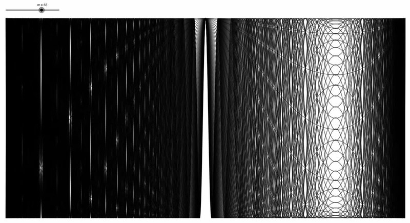

# MiscTest1

[Carotid–Kundalini fractal animation](https://commons.wikimedia.org/wiki/File:Carotid%E2%80%93Kundalini_fractal_animation.webm) by Wattcle from the Wikimedia commons. Licensed under [CC BY-SA 4.0](https://creativecommons.org/licenses/by-sa/4.0/deed.en).

## Bare URL (MP4, similar to issues)

This is what the online Markdown editor does

https://github.com/user-attachments/assets/84fcaa1c-f4db-4c9c-a1f1-1dc6e3f0ae8b

## Bare URL

Same as above, but this video was attached to an issue first.

https://github.com/user-attachments/assets/6ef2a9f8-0b0e-4efa-978f-4521be170a34

## Bare URL, not a user attachment

https://github.com/PathogenPlayground/MiscTest2/raw/refs/heads/main/Carotid%E2%80%93Kundalini_fractal_animation.mp4

## Embed syntax (MP4)

(Does not work, tries to treat it as an image)

## Full video HTML syntax (MP4)

<video autoplay="" loop="" muted="" playsinline="" poster="Carotid–Kundalini_fractal_animation.jpg">
<source src="Carotid–Kundalini_fractal_animation.mp4" type="video/mp4">

</video>

## Short video HTML syntax (MP4)

<video src="Carotid–Kundalini_fractal_animation.mp4"></video>

### Link to raw URL

<video src="https://github.com/PathogenPlayground/MiscTest2/raw/refs/heads/main/Carotid%E2%80%93Kundalini_fractal_animation.mp4"></video>

### Link to issue video

<video src="https://github.com/user-attachments/assets/6ef2a9f8-0b0e-4efa-978f-4521be170a34"></video>

## Short video HTML syntax (WebM)

<video src="Carotid–Kundalini_fractal_animation.webm"></video>
